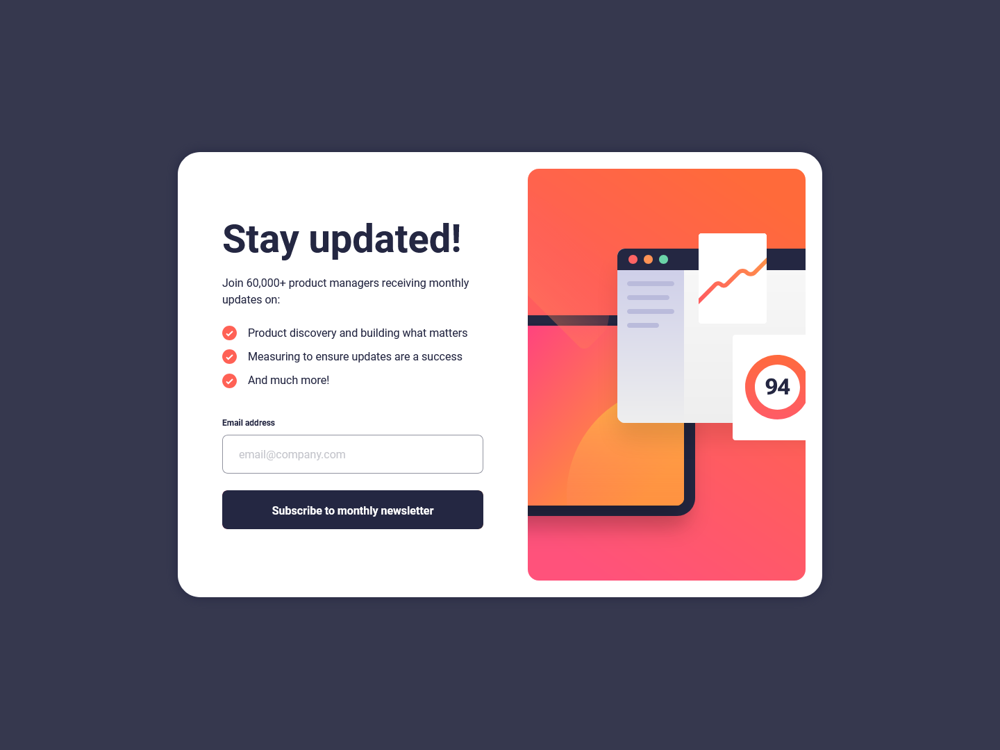
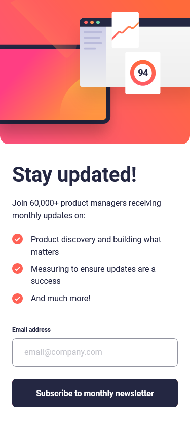

# Frontend Mentor - Newsletter sign-up form with success message solution

This is a solution to the [Newsletter sign-up form with success message challenge on Frontend Mentor](https://www.frontendmentor.io/challenges/newsletter-signup-form-with-success-message-3FC1AZbNrv). Frontend Mentor challenges help you improve your coding skills by building realistic projects. 

## Table of contents

- [Overview](#overview)
  - [The challenge](#the-challenge)
  - [Screenshot](#screenshot)
  - [Links](#links)
- [My process](#my-process)
  - [Built with](#built-with)
  - [What I learned](#what-i-learned)
  - [Continued development](#continued-development)
- [Author](#author)

## Overview

### The challenge

Users should be able to:

- Add their email and submit the form
- See a success message with their email after successfully submitting the form
- See form validation messages if:
  - The field is left empty
  - The email address is not formatted correctly
- View the optimal layout for the interface depending on their device's screen size
- See hover and focus states for all interactive elements on the page

### Screenshot

### Links

- Solution URL: [GitHub Repo](https://github.com/CardboardPL/Frontend-Mentor-Newsletter-Sign-Up-With-Success-Message)
- Live Site URL: [GitHub Pages](https://cardboardpl.github.io/Frontend-Mentor-Newsletter-Sign-Up-With-Success-Message/)

## My process

### Built with

- Semantic HTML5 markup
- CSS custom properties
- Flexbox
- JavaScript
- Mobile-first workflow

### What I learned

I learned how to hide and show elements more reliably and how to make my code more structured.

### Continued development

I plan to gradually add the transitions in the future and to just treat this as experience to make future projects better.

## Author

- Frontend Mentor - [@CardboardPL](https://www.frontendmentor.io/profile/CardboardPL)
- Twitter - [@SirPLWasTaken](https://www.twitter.com/SirPLWasTaken)
